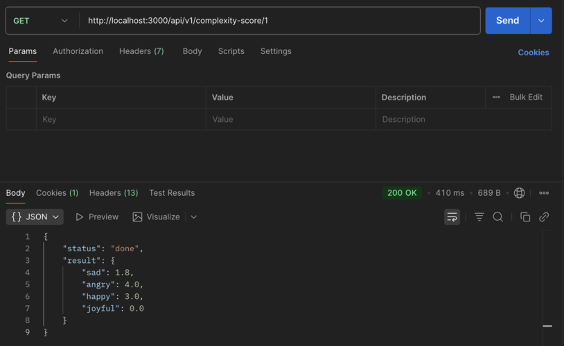

## Word complexity API

This project is a REST API for calculating word complexity using the Free Dictionary API.

## Instruction

Do a POST request with a body in the format ["happy", "joyful", "sad", "angry"] and get a response job_id: ID. Use this ID to get the calculation result when it is completed. Add the ID into the request http://localhost:3000/api/v1/complexity-score/ID (<<-- right here) to see the status and result of words.

## Status Explanation
- Pending – task created
- In Progress – calculation started
- Done – calculation completed, result successfully saved
- Failed – calculation failed, errors saved

## Result
- Rspec tests pass successfully
- POST request:  

- GET request: 

## Documetation API

http://localhost:3000/api-docs

## Stek

- Ruby 3.4.4
- Ruby on Rails 8.0.3
- PostgreSQL
- RSpec + FactoryBot
- Swagger (Rswag)

#### Author
Timur Kim [Telegram](https://t.me/@Thunder_Tim) | [GitHub](https://github.com/TimDelRey)
